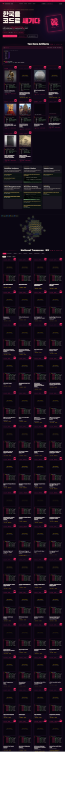
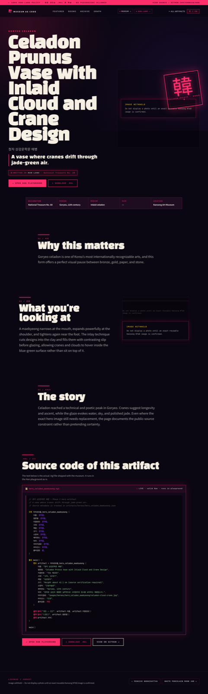
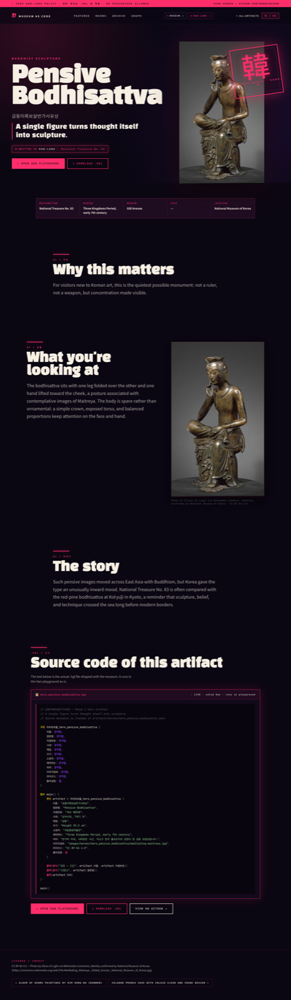

# Museum as Code — Han-lang Cultural Archive

[](LICENSE)
[](https://github.com/xodn348/han)
[](docs/manifest.json)
[](docs/data/heroes/index.json)
[](.github/workflows/han-validate.yml)

**Live site:** https://xodn348.github.io/museum-as-code/<br>
**Museum repo:** https://github.com/xodn348/museum-as-code<br>
**Han-lang repo:** https://github.com/xodn348/han · **Playground:** https://xodn348.github.io/han/playground/

---

## Preview

<table>
  <tr>
    <td align="center" width="50%">
      <a href="https://xodn348.github.io/museum-as-code/">
        
      </a>
      <br><sub><b>Home · 1440</b> — Hangul typography hero, 韓 seal, dual GH chips, 10 hero cards + 64 national-treasure code cards</sub>
    </td>
    <td align="center" width="50%">
      <a href="https://xodn348.github.io/museum-as-code/hero.html?id=hero_celadon_maebyeong">
        
      </a>
      <br><sub><b>Hero detail · 1440</b> — curator narrative, real <code>.hgl</code> source panel with KPDH-A syntax highlighting</sub>
    </td>
  </tr>
  <tr>
    <td align="center">
      <a href="https://xodn348.github.io/museum-as-code/hero.html?id=hero_pensive_bodhisattva">
        
      </a>
      <br><sub><b>Hero detail · 1440</b> — Pensive Bodhisattva (National Treasure No. 83)</sub>
    </td>
    <td align="center">
      <a href="https://xodn348.github.io/museum-as-code/">
        
      </a>
      <br><sub><b>Home · 375</b> — banner stacks, dual GH chips wrap, 44px touch targets, archive cards collapse to <code>tap → view source</code> chips</sub>
    </td>
  </tr>
</table>

---

## 🚨 Han-Lang Only

**Every code block in this project — homepage cards, hero pages, downloadable artifact files, README examples, demo snippets, anything — MUST be valid, executable Han-lang (`.hgl`).** Pseudocode and Korean-keyword-flavored fake syntax are forbidden. If `hgl interpret file.hgl` cannot run it, it does not go in this repo.

This is the project's hardest rule because the museum is simultaneously a Korean cultural archive **and** the canonical real-world demo of the Han programming language. Both jobs require valid Han.

The full mandate, keyword reference, and PR review gates live in [`CLAUDE.md`](./CLAUDE.md). Read it before opening a PR that adds or modifies code in this repo.

---

## What this is

**Museum as Code** is a digital museum experiment that treats Korean cultural heritage as **Han-lang (`.hgl`) source code**. The site doubles as a working showcase of the [Han programming language](https://github.com/xodn348/han) — every artifact card on the homepage is a real `.hgl` snippet that runs unchanged in the [Han playground](https://xodn348.github.io/han/playground/).

The current homepage is intentionally **code-first**: it does not lead with large artifact photos, because some image/object matches still need exact source and license verification. Instead, the public interface foregrounds:

- `.hgl` source snippets as the visual signature,
- provenance and metadata sidecars,
- curated hero pages for 10 representative artifacts,
- room-based navigation and a secondary connection graph,
- a broader 64-record code archive.

Rather than presenting Korean cultural heritage as a photo catalog, the project leads with **Han-lang source code, provenance, and structured metadata**. Photographs are reintroduced only after the exact artifact, source, and license match has been verified.

---

## Current experience

| Surface | Purpose |
| --- | --- |
| `docs/index.html` | Code-first homepage with GitHub CTA, featured code cards, rooms, archive, graph |
| `docs/hero.html?id=<hero_id>` | Immersive single-artifact hero page with curator copy and `.hgl` source panel |
| `docs/data/heroes/index.json` | Web manifest for 10 curated hero artifacts |
| `docs/data/artifacts/` | GitHub Pages-safe copies of artifact `.json` and `.hgl` records |
| `docs/manifest.json` | 64-record archive manifest |
| `docs/data/graph.json` | Artifact relationship graph data |

### Hero artifacts

The curated Phase C set contains 10 hero records under `artifacts/heroes/` and web copies under `docs/data/heroes/`:

1. Pensive Bodhisattva — National Treasure No. 83
2. Celadon Prunus Vase with Inlaid Cloud and Crane Design
3. White Porcelain Moon Jar
4. Hunminjeongeum Haerye
5. Gold Crown from Geumgwanchong Tomb
6. Baekje Gilt-bronze Incense Burner
7. Divine Bell of King Seongdeok
8. Tripitaka Koreana Woodblocks
9. Stone Constellation Chart
10. Danwon Genre Album

Some images remain marked with `needs_verification`; those photos are deliberately hidden from homepage cards until exact matching is resolved.

---

## Han-lang example

```hgl
// Real hero-page style source
구조 히어로유물_hero_pensive_bodhisattva {
    이름: 문자열,
    영문명: 문자열,
    지정번호: 문자열,
    시대: 문자열,
    재질: 문자열,
    소장처: 문자열,
    라이선스: 문자열,
}

함수 main() {
    변수 이름 = "금동미륵보살반가사유상"
    변수 영문명 = "Pensive Bodhisattva"
    변수 지정번호 = "국보 제83호"

    출력(형식("{0} — {1}", 이름, 지정번호))
}

main()
```

Han-lang uses Korean keywords such as `구조`, `함수`, `변수`, `문자열`, `정수`, `출력`, and `형식`. In this project, `.hgl` is both data representation and visual identity.

---

## Design System: KPDH-A · 부적 굿판 / Talisman Ritual

The current visual direction is **KPDH-A**: neon talisman aesthetics drawn from public-domain Korean folk motifs (단청, 부적, 까치, 연꽃, 호랑이) layered on top of a code-first surface. KPDH-inspired in vibe only — **zero copyright lift**, no KPDH photos, characters, or trademarked marks. Full notes in [`DESIGN.md`](./DESIGN.md).

### Palette

| Token | Hex | Use |
| --- | --- | --- |
| `--ink` | `#0a0612` | Primary background. Near-black with violet bias. |
| `--rose` | `#ff2e6a` | Primary accent. Borders, seals, glow. |
| `--rose-deep` | `#b3083d` | Hover/pressed states. |
| `--paper` | `#f6efe3` | Body text on ink, paper-mode backgrounds. |
| `--gold` | `#ffd60a` | Han keywords (`구조`, `함수`, …) in code. |
| `--violet` | `#8b3dff` | Han types (`문자열`, `정수`, …) in code. |
| `--jade` | `#9be29b` | Han string literals in code. |

### Typography (all OFL-licensed, served via Google Fonts)

- **Black Han Sans** — display 한글 (hero `<h1>`, seal stamps).
- **Noto Sans KR** — body 한글 (lede paragraphs, captions).
- **JetBrains Mono** — every `.hgl` code block, file tags, lang badges.

### Code highlighting

The standalone module `docs/han-highlight.js` (zero dependency) is the single source of truth for `.hgl` token coloring. It exposes `window.Han.highlight(text)` and auto-runs on `pre.hgl`, `code.hgl`, and `code.language-han` elements after `DOMContentLoaded`. Both `docs/app.js` and `docs/hero.js` delegate to it so home + hero render with the identical KPDH-A palette.

---

## Repository layout

```text
museum-as-code/
├── artifacts/
│   ├── heroes/                    # 10 curated hero artifacts: .json + .md + .hgl
│   ├── national-treasures/        # 57 national-treasure records: .json + .hgl
│   └── special/kdh/               # 7 KDH cultural-reference records
├── docs/
│   ├── index.html                 # GitHub Pages homepage
│   ├── hero.html                  # single hero artifact route
│   ├── app.js / graph.js          # frontend behavior
│   ├── style.css / hero.css       # code-first visual system
│   ├── data/
│   │   ├── artifacts/             # Pages-safe artifact record copies
│   │   ├── heroes/                # Pages-safe hero records + .hgl previews
│   │   ├── graph.json
│   │   └── rooms.json
│   └── images/                    # local image assets, not homepage-leading by default
├── pipeline/
│   ├── artifact_io.py             # shared path/data helpers
│   ├── manifest.py                # writes docs/manifest.json
│   ├── sync_docs_artifacts.py     # copies records into docs/data/artifacts
│   ├── normalize_sidecars.py      # normalizes provenance/local-image fields
│   ├── generate_graph.py          # writes docs/data/graph.json
│   └── validate_data.py           # data and asset integrity checks
├── DESIGN.md                      # design rules and code-first rationale
└── plans/                         # redesign planning artifacts
```

---

## Run locally

No frontend build step is required; the site is static.

```bash
cd ~/code/museum-as-code
python3 -m http.server 8765 --directory docs
```

Open: http://127.0.0.1:8765/

### Quickstart: the dual purpose

The repo serves two audiences from one source tree:

1. **As a cultural archive** — open `docs/index.html` in a browser and explore 64 national-treasure records grouped by category (Sculpture / Ceramic / Metal / Painting / Records / Architecture). Each card is a runnable Han snippet; each hero page (`docs/hero.html?id=<hero_id>`) carries curator copy plus the real `.hgl` source.
2. **As a Han-lang demo** — every `.hgl` file under `artifacts/heroes/`, `artifacts/national-treasures/`, and `artifacts/special/kdh/` runs unchanged with `hgl interpret file.hgl`. The `Open Han Playground` button on every hero page jumps straight to the live REPL; the `Download .hgl` button gives you the canonical source.

To verify a single artifact end-to-end:

```bash
hgl interpret artifacts/heroes/hero_pensive_bodhisattva.hgl
```

---

## Data pipeline commands

```bash
# Normalize sidecars after metadata/image-source edits
python3 -m pipeline.normalize_sidecars

# Copy artifact .json/.hgl records into GitHub Pages-safe docs/data paths
python3 -m pipeline.sync_docs_artifacts

# Regenerate archive manifest
python3 -m pipeline.manifest

# Regenerate graph data
python3 -m pipeline.generate_graph

# Validate JSON, local paths, hero files, manifest, and graph
python3 -m pipeline.validate_data
```

Recommended verification before pushing:

```bash
node --check docs/app.js
node --check docs/graph.js
node --check docs/hero.js
python3 -m pipeline.validate_data
```

---

## Image/provenance policy

1. **Do not hotlink production artifact images.** Use local files under `docs/images/...`.
2. **Do not show uncertain photos as primary homepage visuals.** If a source match is not exact, leave `needs_verification` and use the code-first presentation.
3. **Record source and license fields** in sidecar JSON and `docs/images/heroes/*/image-sources.json`.
4. **Reintroduce photos per artifact only after verification**, not as broad automatic thumbnails.

---

## Contributing

Contributions are welcome, especially:

- replacing `needs_verification` image placeholders with exact verified sources,
- improving hero artifact metadata and curator copy,
- extending `.hgl` records,
- improving validation scripts,
- refining the code-first design system without making photos the default entry surface again.

Before opening a PR, run:

```bash
node --check docs/app.js
node --check docs/graph.js
node --check docs/hero.js
python3 -m pipeline.validate_data
```

---

## License

This project is distributed under the **MIT License**. See [LICENSE](LICENSE).
